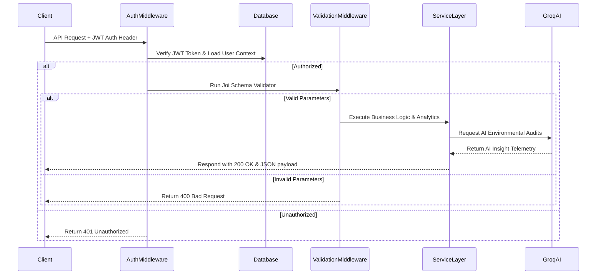

# 💻 Green Economy APi Backend
 
<div align="center">
  
</div>

<div align="center">
       
</div>

مستودع الخادم البرمجي الخلفي (REST API) لمشروع **مؤشرات الاقتصاد الأخضر**، مبني باستخدام Node.js وبيئة Express، ومتصل بقاعدة بيانات MongoDB لحفظ إحصائيات الطاقة والتغير المناخي مع دمج تقنيات الذكاء الاصطناعي (Groq Llama 3) لإصدار تحليلات السياسات البيئية والتنبيهات الذكية.

An enterprise-grade RESTful API backend engineered for the Green Economy monitoring suite. It coordinates user authentication, sustainable projects catalogs, dynamic configuration parameters, and integrates an AI capability layer powered by Groq Llama 3 to analyze carbon metrics and yield policy advice logs.

---

## 🧬 API Request & Validation Lifecycle

The backend manages secure JWT telemetry inputs and delegates tasks to the AI layer:



---

## 🛠️ Technology Stack & Layering

*   **Runtime & Server**: **Node.js** v18 + **Express.js** (modular routing pattern).
*   **Database & ORM**: **MongoDB** document database + **Mongoose** schema ODM.
*   **AI Integration**: **Groq SDK** performing strict inference queries on Llama 3.
*   **Auth & Safety**: **JsonWebToken** (JWT tokens) + **bcrypt** hashing + **Joi** schema validation.

---

## 📂 Repository Module Layout

```text
green-economy-api/
├── src/
│   ├── database/         # MongoDB connection & Mongoose schemas
│   ├── middleWare/       # JWT Auth & Joi payload validators
│   ├── modules/          # Auth, Dashboard, Projects, Settings features
│   └── utils/            # Centralized async & global error handlers
├── index.js              # Server entry point
├── package.json          # Node dependencies
└── vercel.json           # Vercel Serverless routing specs
```

---

## 🚀 Local Setup & Run

### 📋 Prerequisites
*   Node.js v18 or higher
*   Active MongoDB cluster connection URI
*   Groq API Access Key

### ⚙️ Quick Start Steps
```bash
git clone https://github.com/Green-Economy/Green-Economy-APi.git
cd Green-Economy-APi
npm install
# Configure your .env variables (PORT, MONGO_URI, JWT_SECRET, GROQ_API_KEY)
npm run seed  # Pre-populate database with default indicators stats
npm run dev
```

---

## 📄 License
Licensed under the **MIT License**.
